```mermaid
flowchart TB
    subgraph upstream["Dependants (2)"]
        P2["<b>📦&nbsp;TriviaSpark.Core.csproj</b><br/><small>net9.0</small>"]
        P3["<b>📦&nbsp;TriviaSpark.Web.csproj</b><br/><small>net9.0</small>"]
        click P2 "#triviasparkcoretriviasparkcorecsproj"
        click P3 "#triviasparkwebtriviasparkwebcsproj"
    end
    subgraph current["HttpClientDecorator.csproj"]
        MAIN["<b>📦&nbsp;HttpClientDecorator.csproj</b><br/><small>net9.0</small>"]
        click MAIN "#httpclientdecoratorhttpclientdecoratorcsproj"
    end
    P2 --> MAIN
    P3 --> MAIN

```

```mermaid
flowchart TB
    subgraph current["JeopardyData.Console.csproj"]
        MAIN["<b>📦&nbsp;JeopardyData.Console.csproj</b><br/><small>net9.0</small>"]
        click MAIN "#jeopardydataconsolejeopardydataconsolecsproj"
    end

```

```mermaid
flowchart TB
    subgraph current["TriviaSpark.Console.csproj"]
        MAIN["<b>📦&nbsp;TriviaSpark.Console.csproj</b><br/><small>net9.0</small>"]
        click MAIN "#triviasparkconsoletriviasparkconsolecsproj"
    end
    subgraph downstream["Dependencies (1"]
        P2["<b>📦&nbsp;TriviaSpark.Core.csproj</b><br/><small>net9.0</small>"]
        click P2 "#triviasparkcoretriviasparkcorecsproj"
    end
    MAIN --> P2

```

```mermaid
flowchart TB
    subgraph current["TriviaSpark.Core.Tests.csproj"]
        MAIN["<b>📦&nbsp;TriviaSpark.Core.Tests.csproj</b><br/><small>net9.0</small>"]
        click MAIN "#triviasparkcoreteststriviasparkcoretestscsproj"
    end
    subgraph downstream["Dependencies (1"]
        P2["<b>📦&nbsp;TriviaSpark.Core.csproj</b><br/><small>net9.0</small>"]
        click P2 "#triviasparkcoretriviasparkcorecsproj"
    end
    MAIN --> P2

```

```mermaid
flowchart TB
    subgraph upstream["Dependants (3)"]
        P3["<b>📦&nbsp;TriviaSpark.Web.csproj</b><br/><small>net9.0</small>"]
        P4["<b>📦&nbsp;TriviaSpark.Console.csproj</b><br/><small>net9.0</small>"]
        P5["<b>📦&nbsp;TriviaSpark.Core.Tests.csproj</b><br/><small>net9.0</small>"]
        click P3 "#triviasparkwebtriviasparkwebcsproj"
        click P4 "#triviasparkconsoletriviasparkconsolecsproj"
        click P5 "#triviasparkcoreteststriviasparkcoretestscsproj"
    end
    subgraph current["TriviaSpark.Core.csproj"]
        MAIN["<b>📦&nbsp;TriviaSpark.Core.csproj</b><br/><small>net9.0</small>"]
        click MAIN "#triviasparkcoretriviasparkcorecsproj"
    end
    subgraph downstream["Dependencies (1"]
        P1["<b>📦&nbsp;HttpClientDecorator.csproj</b><br/><small>net9.0</small>"]
        click P1 "#httpclientdecoratorhttpclientdecoratorcsproj"
    end
    P3 --> MAIN
    P4 --> MAIN
    P5 --> MAIN
    MAIN --> P1

```

```mermaid
flowchart TB
    subgraph current["TriviaSpark.Web.csproj"]
        MAIN["<b>📦&nbsp;TriviaSpark.Web.csproj</b><br/><small>net9.0</small>"]
        click MAIN "#triviasparkwebtriviasparkwebcsproj"
    end
    subgraph downstream["Dependencies (2"]
        P2["<b>📦&nbsp;TriviaSpark.Core.csproj</b><br/><small>net9.0</small>"]
        P1["<b>📦&nbsp;HttpClientDecorator.csproj</b><br/><small>net9.0</small>"]
        click P2 "#triviasparkcoretriviasparkcorecsproj"
        click P1 "#httpclientdecoratorhttpclientdecoratorcsproj"
    end
    MAIN --> P2
    MAIN --> P1

```

# Projects and dependencies analysis

This document provides a comprehensive overview of the projects and their dependencies in the context of upgrading to .NET 9.0.

## Table of Contents

- [Projects Relationship Graph](#projects-relationship-graph)
- [Project Details](#project-details)

  - [HttpClientDecorator\HttpClientDecorator.csproj](#httpclientdecoratorhttpclientdecoratorcsproj)
  - [JeopardyData.Console\JeopardyData.Console.csproj](#jeopardydataconsolejeopardydataconsolecsproj)
  - [TriviaSpark.Console\TriviaSpark.Console.csproj](#triviasparkconsoletriviasparkconsolecsproj)
  - [TriviaSpark.Core.Tests\TriviaSpark.Core.Tests.csproj](#triviasparkcoreteststriviasparkcoretestscsproj)
  - [TriviaSpark.Core\TriviaSpark.Core.csproj](#triviasparkcoretriviasparkcorecsproj)
  - [TriviaSpark.Web\TriviaSpark.Web.csproj](#triviasparkwebtriviasparkwebcsproj)
- [Aggregate NuGet packages details](#aggregate-nuget-packages-details)

## Projects Relationship Graph

Legend:
📦 SDK-style project
⚙️ Classic project

## Project Details

### HttpClientDecorator\HttpClientDecorator.csproj

#### Project Info

- **Current Target Framework:** net9.0
- **Proposed Target Framework:** net10.0
- **SDK-style**: True
- **Project Kind:** ClassLibrary
- **Dependencies**: 0
- **Dependants**: 2
- **Number of Files**: 4
- **Lines of Code**: 222

#### Dependency Graph

Legend:
📦 SDK-style project
⚙️ Classic project

#### Project Package References

| Package | Type | Current Version | Suggested Version | Description |
| :--- | :---: | :---: | :---: | :--- |
| Microsoft.Extensions.Http | Explicit | 9.0.2 | 10.0.0 | NuGet package upgrade is recommended |

### JeopardyData.Console\JeopardyData.Console.csproj

#### Project Info

- **Current Target Framework:** net9.0
- **Proposed Target Framework:** net10.0
- **SDK-style**: True
- **Project Kind:** DotNetCoreApp
- **Dependencies**: 0
- **Dependants**: 0
- **Number of Files**: 4
- **Lines of Code**: 76

#### Dependency Graph

Legend:
📦 SDK-style project
⚙️ Classic project

#### Project Package References

| Package | Type | Current Version | Suggested Version | Description |
| :--- | :---: | :---: | :---: | :--- |

### TriviaSpark.Console\TriviaSpark.Console.csproj

#### Project Info

- **Current Target Framework:** net9.0
- **Proposed Target Framework:** net10.0
- **SDK-style**: True
- **Project Kind:** DotNetCoreApp
- **Dependencies**: 1
- **Dependants**: 0
- **Number of Files**: 1
- **Lines of Code**: 3

#### Dependency Graph

Legend:
📦 SDK-style project
⚙️ Classic project

#### Project Package References

| Package | Type | Current Version | Suggested Version | Description |
| :--- | :---: | :---: | :---: | :--- |

### TriviaSpark.Core.Tests\TriviaSpark.Core.Tests.csproj

#### Project Info

- **Current Target Framework:** net9.0
- **Proposed Target Framework:** net10.0
- **SDK-style**: True
- **Project Kind:** ClassLibrary
- **Dependencies**: 1
- **Dependants**: 0
- **Number of Files**: 7
- **Lines of Code**: 908

#### Dependency Graph

Legend:
📦 SDK-style project
⚙️ Classic project

#### Project Package References

| Package | Type | Current Version | Suggested Version | Description |
| :--- | :---: | :---: | :---: | :--- |
| coverlet.collector | Explicit | 6.0.4 |  | ✅Compatible |
| Microsoft.NET.Test.Sdk | Explicit | 17.13.0 |  | ✅Compatible |
| MSTest.TestAdapter | Explicit | 3.8.2 |  | ✅Compatible |
| MSTest.TestFramework | Explicit | 3.8.2 |  | ✅Compatible |

### TriviaSpark.Core\TriviaSpark.Core.csproj

#### Project Info

- **Current Target Framework:** net9.0
- **Proposed Target Framework:** net10.0
- **SDK-style**: True
- **Project Kind:** ClassLibrary
- **Dependencies**: 1
- **Dependants**: 3
- **Number of Files**: 34
- **Lines of Code**: 1937

#### Dependency Graph

Legend:
📦 SDK-style project
⚙️ Classic project

#### Project Package References

| Package | Type | Current Version | Suggested Version | Description |
| :--- | :---: | :---: | :---: | :--- |
| Microsoft.AspNetCore.Identity.EntityFrameworkCore | Explicit | 9.0.2 | 10.0.0 | NuGet package upgrade is recommended |
| Microsoft.AspNetCore.Identity.UI | Explicit | 9.0.2 | 10.0.0 | NuGet package upgrade is recommended |
| Microsoft.EntityFrameworkCore.Sqlite | Explicit | 9.0.2 | 10.0.0 | NuGet package upgrade is recommended |
| Microsoft.EntityFrameworkCore.Tools | Explicit | 9.0.2 | 10.0.0 | NuGet package upgrade is recommended |
| System.Drawing.Common | Explicit | 9.0.2 | 10.0.0 | NuGet package upgrade is recommended |
| System.Runtime.Caching | Explicit | 9.0.2 | 10.0.0 | NuGet package upgrade is recommended |
| System.Text.Json | Explicit | 9.0.2 | 10.0.0 | NuGet package upgrade is recommended |

### TriviaSpark.Web\TriviaSpark.Web.csproj

#### Project Info

- **Current Target Framework:** net9.0
- **Proposed Target Framework:** net10.0
- **SDK-style**: True
- **Project Kind:** AspNetCore
- **Dependencies**: 2
- **Dependants**: 0
- **Number of Files**: 152
- **Lines of Code**: 6905

#### Dependency Graph

Legend:
📦 SDK-style project
⚙️ Classic project

#### Project Package References

| Package | Type | Current Version | Suggested Version | Description |
| :--- | :---: | :---: | :---: | :--- |
| Microsoft.Extensions.Diagnostics.HealthChecks | Explicit | 9.0.2 | 10.0.0 | NuGet package upgrade is recommended |
| Microsoft.Extensions.Diagnostics.HealthChecks.EntityFrameworkCore | Explicit | 9.0.2 | 10.0.0 | NuGet package upgrade is recommended |
| NLog.Web.AspNetCore | Explicit | 5.4.0 |  | ✅Compatible |

## Aggregate NuGet packages details

| Package | Current Version | Suggested Version | Projects | Description |
| :--- | :---: | :---: | :--- | :--- |
| coverlet.collector | 6.0.4 |  | [TriviaSpark.Core.Tests.csproj](#triviasparkcoretestscsproj) | ✅Compatible |
| Microsoft.AspNetCore.Identity.EntityFrameworkCore | 9.0.2 | 10.0.0 | [TriviaSpark.Core.csproj](#triviasparkcorecsproj) | NuGet package upgrade is recommended |
| Microsoft.AspNetCore.Identity.UI | 9.0.2 | 10.0.0 | [TriviaSpark.Core.csproj](#triviasparkcorecsproj) | NuGet package upgrade is recommended |
| Microsoft.EntityFrameworkCore.Sqlite | 9.0.2 | 10.0.0 | [TriviaSpark.Core.csproj](#triviasparkcorecsproj) | NuGet package upgrade is recommended |
| Microsoft.EntityFrameworkCore.Tools | 9.0.2 | 10.0.0 | [TriviaSpark.Core.csproj](#triviasparkcorecsproj) | NuGet package upgrade is recommended |
| Microsoft.Extensions.Diagnostics.HealthChecks | 9.0.2 | 10.0.0 | [TriviaSpark.Web.csproj](#triviasparkwebcsproj) | NuGet package upgrade is recommended |
| Microsoft.Extensions.Diagnostics.HealthChecks.EntityFrameworkCore | 9.0.2 | 10.0.0 | [TriviaSpark.Web.csproj](#triviasparkwebcsproj) | NuGet package upgrade is recommended |
| Microsoft.Extensions.Http | 9.0.2 | 10.0.0 | [HttpClientDecorator.csproj](#httpclientdecoratorcsproj) | NuGet package upgrade is recommended |
| Microsoft.NET.Test.Sdk | 17.13.0 |  | [TriviaSpark.Core.Tests.csproj](#triviasparkcoretestscsproj) | ✅Compatible |
| MSTest.TestAdapter | 3.8.2 |  | [TriviaSpark.Core.Tests.csproj](#triviasparkcoretestscsproj) | ✅Compatible |
| MSTest.TestFramework | 3.8.2 |  | [TriviaSpark.Core.Tests.csproj](#triviasparkcoretestscsproj) | ✅Compatible |
| NLog.Web.AspNetCore | 5.4.0 |  | [TriviaSpark.Web.csproj](#triviasparkwebcsproj) | ✅Compatible |
| System.Drawing.Common | 9.0.2 | 10.0.0 | [TriviaSpark.Core.csproj](#triviasparkcorecsproj) | NuGet package upgrade is recommended |
| System.Runtime.Caching | 9.0.2 | 10.0.0 | [TriviaSpark.Core.csproj](#triviasparkcorecsproj) | NuGet package upgrade is recommended |
| System.Text.Json | 9.0.2 | 10.0.0 | [TriviaSpark.Core.csproj](#triviasparkcorecsproj) | NuGet package upgrade is recommended |

